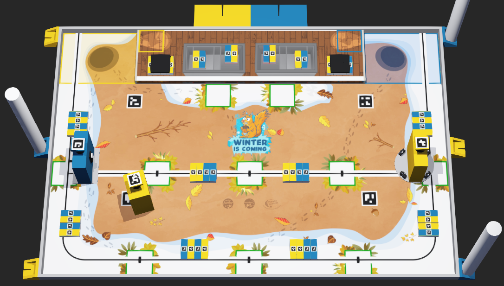

# Simulation Webots Eurobot 2026

Commencez par [installer Webots](https://cyberbotics.com/doc/guide/installation-procedure#installing-the-debian-package-with-the-advanced-packaging-tool-apt), puis lancer la simulation : `webots worlds/world.wbt`.

--------------

This repo is intended to show a simple Eurobot simulation with Webots  
The simulation step is 10 ms (defined in world.wbt) and remember the simulated physics are not perfect!  
This should help you debug and test your robot movement and strategy while the mechanical team works on the robot :D  
These examples are in Python to be more concise

## Robots

**VRACRobot.proto** is a differential drive robot:
- Two wheels driven by motor with encoders
- Two odometry wheels with encoders, mounted on a linear rail to assure ground contact
- A lidar
- A camera
- A servo with a vacuum gripper
- 2 compatible controllers: GamepadRobot and VRACRobotController

**HolonomicRobot.proto** is a holonomic robot:
- Four omni wheels driven by motor with encoders
- A lidar
- A camera
- A gyro (that doesn't drift)
- 2 compatible controller: GamepadHolonomic, AutonomousHolonomic

**DummyRobot.proto** is a dummy robot to test other robots against
- 1 compatible controller: DummyRobot

## Controllers

**GamepadRobot**:  
(use gamepad if found, else use keyboard)  
Gamepad controls: Left horizontal axis (rotation), RT (+speed), LT (-speed), RB (servo), A (vacuum)  
Keyboard controls: Z (forward), S (backward), Q (+rotation), D (-rotation), F (servo), R (vacuum)  
Motors and encoders data are sent in realtime to [Teleplot](https://github.com/nesnes/teleplot)!

**GamepadHolonomic**:  
(use gamepad if found, else use keyboard)  
Gamepad controls: Left horizontal axis (move on Y axis), Left vertical axis (move on X axis), Right horizontal axis (rotate)  
Keyboard controls: Z (+X), S (-X), Q (+Y), D (-Y), A (+rotate), E (-rotate)

**DummyRobot**: 
Move a dummy enemy robot to a random predefined position on the table  
DummyOpponent stops moving if the WbNodeRef "OPPONENT" is very close  
This dummy robot has no physical body, it is only detected by lidar points by other robots  
Used to check the strategy will handle some random situations  
(thanks memristor for this controller)

**AutonomousHolonomic**:  
Autonomous holonomic controller with odometry from motor encoders
Performs a sequence of movements from a position (x, y, t) list

**VRACRobotController**:  
Black magic from the amazing VRAC team.

# Thanks

https://github.com/memristor/mep3/tree/main/mep3_simulation

https://github.com/cvra/robot-software/tree/master/webot_sim

https://github.com/robotique-ecam/simulation-world

