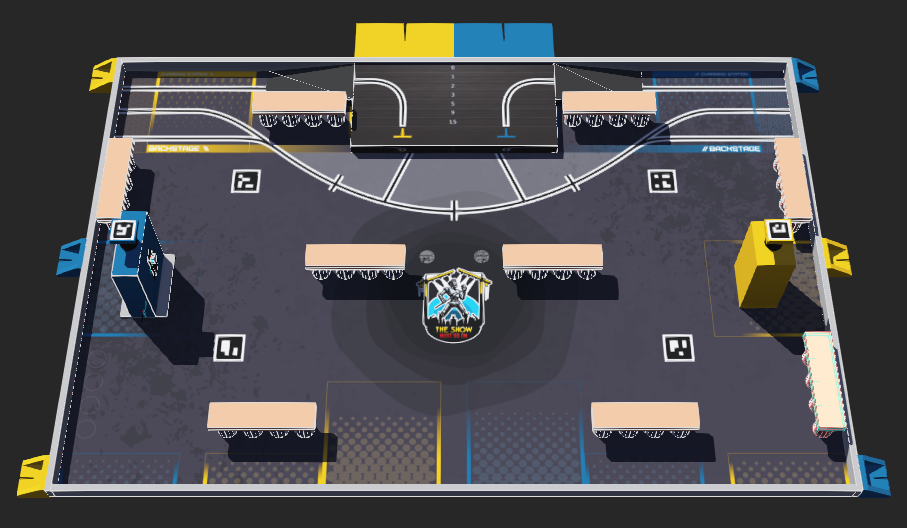
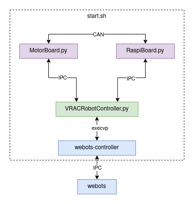

# VRAC Webots examples for Eurobot



This repo is intended to show a simple Eurobot simulation with Webots  
The simulation step is 10 ms (defined in world.wbt) and remember the simulated physics are not perfect!  
This should help you debug and test your robot movement and strategy while the mechanical team works on the robot :D  
These examples are in Python to be more concise

## Robots

**VRACRobot.proto** is a differential drive robot:
- Two wheels driven by motor with encoders
- Two odometry wheels with encoders, mounted on a linear rail to assure ground contact
- A lidar
- A camera
- A servo with a vacuum gripper
- 2 compatible controllers: GamepadRobot and VRACRobotController

**HolonomicRobot.proto** is a holonomic robot:
- Four omni wheels driven by motor with encoders
- A lidar
- A camera
- A gyro (that doesn't drift)
- 1 compatible controller: GamepadHolonomic

**DummyRobot.proto** is a dummy robot to test other robots against
- 1 compatible controller: DummyRobot

## Controllers

**GamepadRobot**:  
(use gamepad if found, else use keyboard)  
Gamepad controls: Left horizontal axis (rotation), RT (+speed), LT (-speed), RB (servo), A (vacuum)  
Keyboard controls: Z (forward), S (backward), Q (+rotation), D (-rotation), F (servo), R (vacuum)  
Motors and encoders data are sent in realtime to [Teleplot](https://github.com/nesnes/teleplot)!

**GamepadHolonomic**:  
(use gamepad if found, else use keyboard)  
Gamepad controls: Left horizontal axis (move on Y axis), Left vertical axis (move on X axis), Right horizontal axis (rotate)  
Keyboard controls: Z (+X), S (-X), Q (+Y), D (-Y), A (+rotate), E (-rotate)

**DummyRobot**: 
Move a dummy enemy robot to a random predefined position on the table  
DummyOpponent stops moving if the WbNodeRef "OPPONENT" is very close  
This dummy robot has no physical body, it is only detected by lidar points by other robots  
Used to check the strategy will handle some random situations  
(thanks memristor for this controller)

**VRACRobotController**:  
See section [VRACRobotController](#VRACRobotController)

## VRACRobotController

(probably linux only because of the virtual CAN)

VRACRobotController.py: an external controller that is used to interface the real robot program with the Webots simulation environment.  

for this example we are using the following programs:

- **raspiboard**: main program that will run on the Raspberry Pi, has lidar connected, communicate through CAN with motorboard

- **motorboard**: embed program that is running on a microcontroller, has motors and odometry connected, communicate through CAN with raspiboard (the program is in Python to simplify this example)



Usage:
```sh
# Install packages
sudo apt install python3 can-utils tmux

# Setup virtual CAN network interface
sudo ip link add dev vcan0 type vcan
sudo ip link set up vcan0
ip link show

# open world.wbt, reset and start simulation

# start external controller VRACRobotController
cd controllers/VRACRobotController
./start.sh
# to quit tmux session, "Ctrl-b" then "Ctrl-q" or "tmux kill-session"
```

# Thanks

https://github.com/memristor/mep3/tree/main/mep3_simulation

https://github.com/cvra/robot-software/tree/master/webot_sim

https://github.com/robotique-ecam/simulation-world

